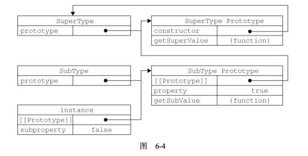

##### 1. `typeof`操作符：
- `undefined`——如果这个值未定义;    
- `Null`——只有一个值的数据类型，`null`
    - `null`：表示一个空对象指针，而这也正是使用 `typeof` 操作符检测 `null` 值时会返回`"object"`的原因
        ```
        var car = null;  
        alert(typeof car); // "object"
        ```
    - `undefined` 值是派生自 `null` 值的
       ```
       alert(null == undefined); //true 
       // 申明保存对象的变量时，就应该明确地让该变量初始值为 `null`,
       // 有助于进一步区分 null 和 undefined
       ```
- `boolean`——如果这个值是布尔值(区分大小写，True和False都不是Boolean值);
    - true, false
    - 任何非空字符串，""空字符串
    - 任何非零数字值，0和NaN
    - 任何对象，null
    - n/a，undefined
- `string`——如果这个值是字符串;
- `number`——如果这个值是数值;
- `object`——如果这个值是对象或 null(null 值表 示一个空对象指针，所以返回`object`);
    - `constructor`：构造函数
    - `hasOwnProperty`：用于检查给定的属性在当前对象实例中(而不是在实例 的原型中)是否存在。
    - `isPrototypeOf(object)`：检查是否为传入对象的原型
    - `propertyIsEnumerable(propertyName)`：检查给定的属性是否能够使用`for-in`语句来枚举
    - `toLocaleString()`：返回对象的字符串表示，该字符串与执行环境的地区对应
    - `toString()`：返回对象的字符串表示
    - `valueOf()`：返回对象的字符串、数值或布尔值表示
- `function`——如果这个值是函数。
    - `arguments`：函数参数数组
    - `length`：参数列表的长度
    - `prototype`：指向原型对象
    - 没有函数重载
    - 命名的参数提供了便利，但是不是必需的
        ```
        function howManyArgs() { alert(arguments.length);}
        howManyArgs("string", 45); //2 
        howManyArgs(); //0 
        howManyArgs(12); //1
        ```

##### 2、变量
- 动态属性:
    1. 对于引用类型，可以动态添加和修改或者删除其属性和方法
        ```
        var person = new Object(); 
        person.name = "Nicholas"; 
        alert(person.name); //"Nicholas"
        ```
    2. 对于基本类型，则不可以
        ```
        var name = "Nicholas";
        name.age = 27;
        alert(name.age); //undefined
        ```
- 变量的赋值：
    1. 基本类型的赋值，会在变量对象上创建一个新值，然后把该值复制 到为新变量分配的位置上
        ```
        var num1 = 5; 
        var num2 = num1;
        //num2 中的 5 与 num1 中的 5 是完全独立的，该值只是 num1 中 5 的一个副本。此后，这两个变量可以参与任 何操作而不会相互影响。
        ```
    2. 引用类型的赋值：拷贝的是对象的指针，所以指向的是同一个对象
    3. `typeof`用于检测基本类型，`instanceof`用于检测引用类型
    
##### [3、执行环境及作用域](https://juejin.im/post/5ca062f0e51d4556a05cf45c)
- 执行环境：定义了变量或函数有权访问的其他数据，决定了他们各自的行为。
- 变量对象：每个执行环境都有一个与之关联的 _**变量对象**_，环境中定义的所有变量和函数都保存在这个对象中
    - 创建 arguments 对象，检查当前环境的参数，初始化属性和属性值。
    - 检查函数声明，当前环境中每发现一个函数就在 VO 中用函数名创建一个属性，以此来引用函数。如果函数名存在，就覆盖这 个属性。
    - 检查变量，当前环境中每发现一个变量就在 VO 中用变量名创建一个属性，并初始化其值为 undefined。如果变量名存在， 则不进行任何处理(注意这是在创建阶段，执行阶段会被赋值)，继续检查。
- 作用域链：当代吗在一个环境中执行时，会创建变量对象的一个 **作用域链**，它的作用就是保证对执行环境中的变量和函数的有序访问。
    - 作用域链的最前端：当前执行环境的变量对象
    - 作用域链的最末端：全局执行环境的变量对象
- 活动对象：进入代码执行阶段，函数环境的变量对象会变成活动对象 AO
- 全局环境：其变量对象就是`window`对象本身
- 延长作用域链：
    - `try-catch`：创建一个新的变量对象(包含的是被抛出的错误对象的声明)，并把它添加到作用域链的前端
    - `with`：会将指定指定的对象添加到作用域链中
        ```
        function buildUrl() {
            var qs = "?debug=true";
            with(location){
                var url = href + qs;
            }
            return url; 
        }
        
        // with 语句接收的是 location 对象，因此其变量对象中就包含了 location 对象的所有属 性和方法，
        // 而这个变量对象被添加到了作用域链的前端，
        // with 语句内部，则定义了一个名为 url 的变量，因而 url 就成了函数执行环境的一 部分，所以可以作为函数的值被返回
        ```
- 没有块级作用域
    ```
    if (true) {
        var color = "blue";
    }
    alert(color); //"blue"
    
    // if 语句中的变量声明会将变量添加到当前的执行环境(在这里是 全局环境)中
    ```
   
- `var` 声明的变量会自动被添加到最接近的环境中，没有使用 var 声明，该变量会自 动被添加到全局环境
- 如果局部环境中存在着同名标识符，就不会使用位于父环境中的标识符

- [ 思考：为什么会出现变量提升：](https://www.cnblogs.com/liuhe688/p/5891273.html)
    - 变量提升是什么：在JS代码执行之前，JS引擎会将变量声明和函数声明提升到当前作用域链的最前端。
    - 作用：解决相互递归的问题。两个函数分别调用了对方，如果没有变量提升，而是顺序执行，那么就会调用到没有声明的函数，导致代码执行失败。
        ```
        - 全局环境创建阶段：检查函数声明，将函数 hello 放入变量对象(全局环境为 window 对象)。
        - 检查变量声明，发现变量 hello 已经存在，则跳过。
        - 执行阶段：执行代码console.log(hello)时，会在全局环境的变量对象中寻找 hello，找到了函数 hello。
        
        console.log(hello); // [Function: hello]
        function hello() { console.log('how are u') }
        var hello = 10;
        ```

##### 5、引用类型
- `Object`
    - 通过对象字面量定义对象时，不会调用`Object`构造函数
- `Array`
    - `join`：以不同的分隔符输出字符串
        ```
        var colors = ["red", "green", "blue"]; 
        alert(colors.join());  //red,green,blue 
        alert(colors.join(""));  //redgreenblue 
        alert(colors.join("||"));  //red||green||blue
        ```    
    - `push`、`pop`：入栈和出栈
    - `shift`、`shift`：入队列和出队列
    - `unshift`：在数组前端添加
    - `sort`、`reverse`：升序排序和降序排序
    - `concat`：平铺数据得到一个新的数组，原来的数组保持不变
    - `slice`：截取数组得到一个新的数组，原来的数组保持不变
    - `splice`
        - 删除：删除任意数量的项，指定2个参数：要删除的第一项的位置和要删除的项数。 例如：`splice(0,2)`会删除数组中的前两项。
        - 插入：插入任意数量的项，指定3个参数：起始位置、0(要删除的项数) 和要插入的项。例如：`splice(2,0,"red","green")`会从当前数组的位置 2 开始插入字符串"red"和"green"
        - 替换：替换任意数量的项，指定3个参数：起始位置、要删除的项数和要插入的任意数量的项。例如：`splice (2,1,"red","green")`会删除当前数组位置 2 的项，然后再从位置 2 开始插入字符串 "red"和"green"。
        ```
        var colors = ["red", "green", "blue"];
        var removed = colors.splice(0,1);                    // 删除第一项
        alert(colors); // green,blue 
        alert(removed); // red，返回的数组中只包含一项
        
        removed = colors.splice(1, 0, "yellow", "orange");  // 从位置 1 开始插入两项 
        alert(colors); // green,yellow,orange,blue           
        alert(removed); // 返回的是一个空数组
        
        removed = colors.splice(1, 1, "red", "purple");      // 插入两项，删除一项
        alert(colors); // green,red,purple,orange,blue 
        alert(removed); // yellow，返回的数组中只包含一项
        ```
    - `indexOf`、`lastIndexOf`：从头和尾开始查找
    - 迭代：
        - `every`：如果该函数对每一项都返回 `true`，则返回 `true`
        - `filter`：返回该函数会返回 `true` 的项组成的数组
        - `forEach`：循环遍历
        - `map`：变换
        - `some`：如果该函数对任一项返回 `true`，则返回 `true`
    - `reduce`、`reduceRight`：迭 12 代数组的所有项，然后构建一个最终返回的值，一个从前，一个从后.
        给 `reduce()`和 `reduceRight()`的函数接收 4 个参数:前一个值、当前值、项的索引和数组对象
        ```
        var values = [1,2,3,4,5];
        var sum = values.reduce(function(prev, cur, index, array){
            return prev + cur;
        });
        alert(sum); //15
        ```
- `Function`
    - 没有函数重载，会覆盖掉之前的共同名函数
    - 函数声明会存在函数声明提升，而函数表达式则不会
        ```
        //函数声明：解析器就已经通过一个名为函数声明提升的过程，
        //读取并将函数声明添加到执行环境中
        alert(sum(10,10)); 
        function sum(num1, num2){
            return num1 + num2;
        }
        
        // 函数表达式：没有函数声明提升
        alert(sum(10,10));
        var sum = function(num1, num2){
            return num1 + num2;
        };
        ```
    - 内部属性
        - `arguments`：数组对象，保存了函数的所有参数
        - `this`：指向函数的执行环境
    - 函数属性和方法
        - `length`：参数的个数
        - `prototype`：原型对象
        - `apply()`：修改函数`this`属性的指向，接收了两个参数：1、运行函数的作用域；
           2、参数数组（Array的实例或者arguments对象）
        - `call()`：和apply作用一样，不同在于参数传递：1、运行函数的作用域；2、将参数
           逐个传递
        - `bind()`：修改函数的执行作用域，会返回一个新的函数实例，接收一个参数
        
- 基本包装类型：`String`、`Boolean`、`Number`
    - 引用类型和基本包装类型的区别：
        ```
        // 使用 new 操作符创建的引用类型的实例，在执行流离开当前作用域之前都一直保存在内存中。
        // 而自动创建的基本包装类型的对象，则只存在于一 行代码的执行瞬间，然后立即被销毁。
        // 这意味着我们不能在运行时为基本类型值添加属性和方法
        var s1 = "some text";
        s1.color = "red"; 
        alert(s1.color); //undefined
        ```
    - 对基本包装类型的实例调用 `typeof` 会返回`object`，而且所有基本包装类型的对象都会被转换为布尔值 `true`。
        
##### 6、对象的创建
- 工厂模式：
    - 减少了创建多个相似对象时的重复代码
    - 没有解决对象识别问题（即怎么知道一个对象的类型）
    
- 构造函数模式：
    - 解决了对象识别问题
    - 问题：每个方法都要在每个实例上重新创建一遍，没有复用性可言
  
- 原型模式:
    - 可以让所有对象实例共享它所包含的属性和方法
    - `for-in`会先访问实例中的属性，然后再去访问原型中的属性。

##### 7、原型链（很少单独使用）
- `SubType.prototype = new SuperType();`：没有使用`SubType`的默认原型，将其替换成`SuperType`的实例。
    这是因为`SuperType`的实例内部的`[[protitype]]`指针指向了`SuperType`
    原型，最终形成一条原型链。
    
- 默认的原型：    
    - 所有引用类型默认都继承了 `Object`，而 这个继承也是通过原型链实现的。
    - 所有函数的默认原型都是 `Object` 的实例，因此默认原 型都会包含一个内部指针，指向 `Object.prototype`
- 通过原型链来实现继承，不能使用对象字面量创建原型方法，这是因为，对象字面量的`prototype`指向的是`Object`，
    这样会重写整个原型链。
- 原型链的问题：
    - 没有访问权限管理：`SuperType`实例对象在被赋值给`SubType.prototype`的时候就变成了原型对象的属性，
        会被所有`SubType`实例共享。
    - 创建子类实例的时候，不能再不影响所有对象实例的情况下，给超类的构造函数传递参数
- 由于原型链存在的问题，在实践中很少单独使用原型链

##### 8、借用构造函数（很少单独使用）   
- 借用构造函数模式解决了子类向超类传递参数的问题
- 问题：和构造函数模式创建对象一样，方法都在构造函数中定义，没有复用性可言。并且超类的原型对子类不可见。
    ```
    function SuperType(name){ 
        this.name = name;
    }
    function SubType(){
        //继承了 SuperType，同时还传递了参数 
        SuperType.call(this, "Nicholas");
        
        //实例属性
        this.age = 29; 
    }
    
    var instance = new SubType(); 
    alert(instance.name); //"Nicholas"; 
    alert(instance.age); //29
    ```
##### 9、组合继承
- 存在的问题：会调用两次超类构造函数
    - 一次是在创建子类型原型的时候
    - 另一次是在子类型构造函数内部
    ```
    function SuperType(name){
        this.name = name;
        this.colors = ["red", "blue", "green"];
    }
    
    SuperType.prototype.sayName = function(){ 
        alert(this.name);
    };
    
    function SubType(name, age){
        //继承属性 
        SuperType.call(this, name);
        this.age = age; 
    }
    
    //继承方法
    SubType.prototype = new SuperType(); 
    SubType.prototype.constructor = SubType; 
    SubType.prototype.sayAge = function(){
        alert(this.age); 
    };
    
    var instance1 = new SubType("Nicholas", 29);
    instance1.colors.push("black");
    alert(instance1.colors);  //"red,blue,green,black" 
    instance1.sayName();      //"Nicholas";
    instance1.sayAge();       //29
    
    var instance2 = new SubType("Greg", 27);
    alert(instance2.colors);   //"red,blue,green"
    instance2.sayName();       //"Greg";
    instance2.sayAge();        //27
    ```
##### 10、原型模式
```
function object(o){
    function F(){}
    return new F()
}

var person = {
    name: "Nicholas",
    friends: ["Shelby", "Court", "Van"] 
};

var anotherPerson = object(person); 
anotherPerson.name = "Greg"; 
anotherPerson.friends.push("Rob");

var yetAnotherPerson = object(person); 
yetAnotherPerson.name = "Linda"; 
yetAnotherPerson.friends.push("Barbie");
alert(person.friends); //"Shelby,Court,Van,Rob,Barbie"
```

##### 11、递归
```
function factorial(num){ 
    if (num <= 1){
        return 1;
    } else {
        return num * factorial(num-1); 
    }
}

function factorial(num){ 
    if (num <= 1){
        return 1;
    } else {
        //arguments.callee 是一个指向正在执行的函数的指针，因此可以用它来实现对函数 的递归调用
        return num * arguments.callee(num-1);
    } 
}

var factorial = (function f(num){ 
    if (num <= 1){
        return 1;
    } else {
        return num * f(num-1);
    } 
});
```

##### 12、闭包

- 闭包：指有权访问另一个函数作用域中的变量的函数
- 创建闭包：在一个函数内部创建另一个函数
    ```
    function createComparisonFunction(propertyName) {
        return function(object1, object2){
            var value1 = object1[propertyName];
            var value2 = object2[propertyName];
            if (value1 < value2){ 
                return -1;
            } else if (value1 > value2){
                return 1;
            } else {
                return 0;
            } 
        };
    }
    ```
- 闭包的 `this`：匿名函数的执行环境具有全局性，因此 `this` 对象指向 `window`

##### 13、DOM(文档对象模型) 和 BOM（浏览器对象模型）
- DOM：DOM把整个页面映射为一个多层节点结构，HTML页面中的每个组成部分都是某种类型的节点，这些节点有包含不同类型的数据。


- `window`：既是 `JavaScript` 访问浏览器窗口的一个接口，又是 ECMAScript 规定的 `Global` 对象
    - `outerWidth` 和 `outerHeight` ：浏览器窗口本身的尺寸
    - `innerWidth` 和 `innerHeight` 则表示该容器中页面视图区的大小(减去边框宽度)
    - `window.open()`：打开窗口
    - 

#### 14、常见的内存泄露
- 意外的全局变量
- 被遗忘的计时器或回调函数
- 脱离 DOM 的引用
- 闭包

##### 15、事件代理
- 事件冒泡：既事件开始时由最具体的元素接收，然后逐级向上传递，知道传递到 `document` 对象。
- 事件捕获：既父元素更早地接收到事件，然后逐级传递到具体的节点，意义在于事件到达目标之前捕获它。
- 事件代理：将需要监听的事件交给父元素处理，如在 `table` 上绑定所有 `td` 的 `click` 事件。

##### 16、`new` 操作符的原理
- 创建一个新对象
- 这个新对象会被执行 `[[Prototype]]` 连接。
- 这个新对象会绑定到函数调用的 `this`。
- 如果函数没有返回其他对象，那么 `new` 表达式中的函数调用会自动返回这个新对象。

##### [17、原型(Prototype)](https://muyiy.cn/blog/5/5.1.html#%E5%BC%95%E8%A8%80)
- 每个对象都拥有一个原型对象，当访问一个对象的属性时，如果这个对象内部不存在这个属性，那么就会去 `prototype` 里面去查找，以此类推，
知道找到属性或 `undefined` 为止，从而形成了原型链
- `constructor`：构造函数的属性，指向构造函数本身，
- `__proto__`：每个实例上都有的属性，但因为性能问题并不推荐使用，推荐使用 `Object.getPrototypeOf()，Object.setPrototypeOf()`
- `prototype`：构造函数的属性，在实例上并不存在
- `p.__proto__` 和 `Parent.prototype` 都是指向同一个对象。
- 原型链的构建依赖于 `__proto__`

##### [18、浅拷贝和深拷贝](https://muyiy.cn/blog/4/4.1.html#%E4%B8%89%E3%80%81%E6%B7%B1%E6%8B%B7%E8%B4%9D%EF%BC%88deep-copy%EF%BC%89)
- 值传递和引用传递：
  - 基本数据类型：值传递，两个变量互不影响
  - 引用数据类型：引用传递，两个变量指向的是同一个对象
- 浅拷贝：如果属性是基本类型，拷贝的就是基本类型的值，如果属性是引用类型，拷贝的就是内存地址，所以如果其中一个对象改变了这个地址，就会影响到另一个对象。
  - `Object.assign()`：合并对象
  - `{...a}`：展开语法和 `Object.assign()` 的作用是一样的
  - `Array.prototype.slice()`：返回新数组，也属于浅拷贝
- 深拷贝：如果属性是基本类型，拷贝的就是基本类型的值，如果属性是引用类型，则拷贝的是动态分配的内存，拷贝前后两个对象互不影响。
  - `JSON.parse(JSON.stringify(object))`
    - `undefined`、`symbol` 和 函数 这三种情况，会直接忽略
    - 循环引用情况下，会报错。
    - `new Date` 情况下，转换结果不正确。
    - 正则转换不正确
- [浅拷贝实现](https://muyiy.cn/blog/4/4.2.html#%E5%BC%95%E8%A8%80)
- [深拷贝实现](https://muyiy.cn/blog/4/4.3.html#%E7%AC%AC%E4%B8%80%E6%AD%A5%EF%BC%9A%E7%AE%80%E5%8D%95%E5%AE%9E%E7%8E%B0)

##### 19、节流和防抖
- 节流(throttle)：在一段时间间隔内，执行第一次事件，丢弃的规定时间间隔内的其他所有事件。
  - 应用于mousemove、scroll等性能优化
  - 实现原理：
    - 判断每次事件请求的间隔，小于时间间隔就舍弃事件
    - 设置定时器，舍弃掉定时器时间间隔内的所有事件请求
- 防抖(debounce)：在一段时间间隔内，执行最后一次事件，每一次事件请求都将重新计时。
  - 应用于搜索联想功能
  - 实现原理：
    - 设置定时器，延时响应时间请求，每次事情请求都会重新设置定时器。

##### 20、前端模块化（Common.js、AMD、CMD）
- Common.js：服务端模块标准规范，Node.js采用了这个规范。
  - 同步加载，在浏览器中会出现阻塞的情况
  - 模块上下文的属性都是私有的，通过 `module.exports` 向外暴露
- AMD：采用异步方式加载模块，需要定义回调函数。
- ES6 Module：一个模块就是一个独立的文件，该文件的所有属性，外部都无法获取，就必须使用 `export` 导出该属性。

##### 20、`null` 和 `undefined` 的区别
- `null`：表示空值，`undefined`：表示不存在这个值，在语义上有所不同
- `null` 和 `undefined` 的类型不同
  ```
  typeof null // object
  typeof undefined //undefined
  ```
- 除此之外，其他大多数情况下都是没有什么区别的

##### 21、如何判断是否为数组
- `Object.prototype.toString.call()`
  - 每一个继承 `Object` 的对象都有 `toString` 方法，如果 `toString` 方法没有重写的话，会返回 `[Object type]`，其中 `type` 为对象的类型
  - 使用 `call` 或者 `apply` 方法来改变 `toString` 方法的执行上下文
  - 常用于判断浏览器内置对象的判断哪
    ```
    const an = ['Hello','An'];
    an.toString(); // "Hello,An"
    Object.prototype.toString.call(an); // "[object Array]"
    ```
- `instanceof`：内部机制是判断在原型链中能否找到类型的 `prototype`
- `Array.isArray()`：用来判断对象是否为数组（ES5新增）

##### [22、`instanceof`的原理](https://muyiy.cn/blog/5/5.2.html#%E5%8E%9F%E5%9E%8B%E9%93%BE)
- 简单说就是：检测 `constructor.prototype` 是否存在于参数 `object` 的原型链上
- `instanceof` 原理就是一层一层查找 `__proto__`，如果和 `constructor.prototype` 相等则返回 `true`，如果一直没有查找成功则返回 `false`。
- 与 `typeof` 的区别：
  - `typeof`：用于基本类型的检测，除了 `null` ,都能正确检测基本类型数据的类型
  - `instanceof`：用于引用数据类型的检测


##### 23、箭头函数和普通函数的区别
- 箭头函数不绑定this，箭头函数的this相当于普通变量
- 箭头函数的this寻值行为与普通变量相同，在作用域中逐级寻找
- 箭头函数的this无法通过bind、call、apply来修改
- 改变作用域中的this的指向可以改变箭头函数的this
- eg. `function closure(){()=>{//code }}`，在此例中，我们通过改变封包环境`closure.bind(another)()`，来改变箭头函数this的指向。

##### 24、实现一个对页面某个节点的拖拽（使用原生js）
- 需要使用 `mousedown`、`mousemove`、`mouseup` 事件
- `mousedown`：事件触发后开始拖拽
- `mousemove`：通过 `event.clientX`、`event.ClientY` 计算拖拽的位置
- `mouseup`：拖拽结束

##### 25、说说从输入URL到看到页面发生的全过程
- 浏览器主进程开启一个下载线程
- 发起http请求，下载网页资源，包括：
  - 进行DNS域名解析
  - 创建tcp连接（三次握手）
  - 等待服务器响应
- 浏览器Render进程开始解析和构建DOM树和CSS树，这两个过程是并行的
- 浏览器在解析和构建的过程中，遇到link、script、img等标签，会去下载资源，遇到有缓存就使用缓存，不适用缓存的就重新下载资源
- DOM树和CSS树构建完成之后，会进行布局和绘制
- 绘制结束后，关闭TCP连接：
  - tcp四次挥手
  
##### 26、ajax、axios、fetch的区别

##### 27、
